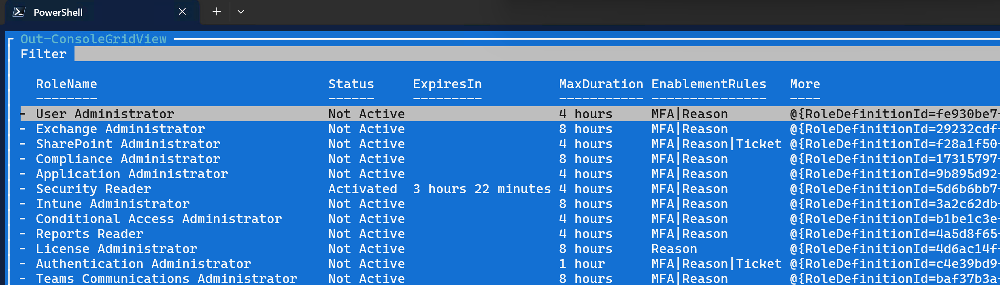
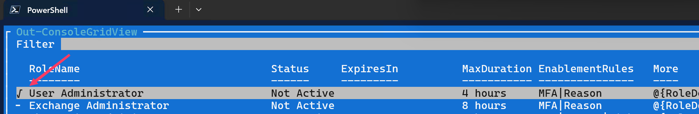
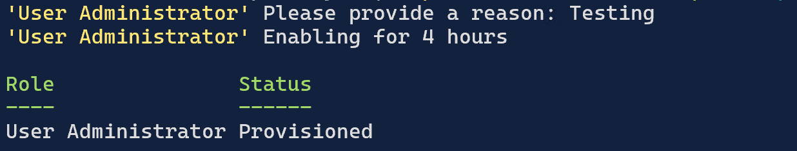

# Graph EasyPIM
Something to make Entra ID PIM easier for end-users. 

You can install the module [from PowerShell Gallery](https://www.powershellgallery.com/packages/Graph.EasyPIM/). 

```powershell
Install-Module -Name Graph.EasyPIM
```

Not using PowerShell Gallery? Download the source code from this 👇 repo, or get started with PowerShell Gallery following the instructions [here](https://learn.microsoft.com/en-gb/powershell/gallery/getting-started?view=powershellget-3.x).

Tested on Windows, macOS, and Linux with PowerShell 7.4. It currently has the following cmdlets:

- `Enable-PIMRole` - enable (activate) Entra ID PIM roles.
- `Enable-PIMGroup` - enable (activate) Entra ID PIM groups.
- `Disable-PIMRole` - disable (deactivate) Entra ID PIM roles.
- `Disable-PIMGroup` - disable (deactivate) Entra ID PIM groups.

## Neat features of this module
- You can select more than 1 role or group at a go. Both to activate or deactivate. 
- Faster than Entra ID portal in my opinion. There is an initial delay as it pulls all the info, but after that it's pretty fast. 
- It always activates the role or group for the maximum allowed duration. 
- When selecting roles or groups, if the role or group is already active (and it's been active for more than 5 mins) it will deactivate and activate the role or group. Very useful when you can see a role or group activation is going to expire soon!
- You can skip offering a reason, either via the `-SkipJustification` switch or pressing `ENTER` when asked for one. This will set the reason as "need for work". 
- You can provide a justification before hand via the `-Justification` switch, or by entering one when prompted and adding an asterisk `*` at the end. This will set the same justification for all other roles or groups enabled in that round. 
- The [Norton Commander](https://en.wikipedia.org/wiki/Norton_Commander)-ish TUI is a nice trip down memory lane. 🙂

## Good to know
- The first time you run one of these cmdlets it will open up a browser window to authenticate. But if you are already connected to Graph, this might not happen and the cmdlets may not work. Do a `Disconnect-MgGraph` and then try the cmdlets again. 
- The list of eligible PIM roles are cached for 30 mins. The list of eligible PIM groups are cached for 8 hours. The cmdlets can be run with the `-RefreshEligibleGroup` to force a refresh. 
- You might need to involve a Global Admin to do some consents on the `Microsoft Graph Command Line Tools` service principal. To do an admin consent on behalf of the organization, a Global Admin is required; but an Application Admin can do consent for themselves. This URL should help (replace `{tenantId}`): `https://login.microsoftonline.com/{tenantId}}/v2.0/adminconsent?client_id=14d82eec-204b-4c2f-b7e8-296a70dab67e&scope=RoleEligibilitySchedule.Read.Directory RoleEligibilitySchedule.ReadWrite.Directory RoleManagement.Read.Directory RoleManagement.Read.All RoleManagement.ReadWrite.Directory RoleAssignmentSchedule.ReadWrite.Directory RoleAssignmentSchedule.Remove.Directory PrivilegedEligibilitySchedule.Read.AzureADGroup PrivilegedEligibilitySchedule.ReadWrite.AzureADGroup PrivilegedAccess.Read.AzureADGroup PrivilegedAccess.ReadWrite.AzureADGroup RoleManagementPolicy.Read.AzureADGroup`

## Pre-requisite modules
This modules depends upon the following. 

- `Microsoft.Graph.Authentication`
- `Microsoft.Graph.Identity.Governance`
- `Microsoft.PowerShell.ConsoleGuiTools`

If it weren't for these, this module wouldn't exist! Thank you 😍 to the creators of these, especially `Microsoft.PowerShell.ConsoleGuiTools` which is what I use to drive things. 🙏

## Screenshots
(These screenshots are from the first version of this module; the latest versions will have slight differences to what's shown below).

Running `Enable-PIMRole` lists all the available and active Entra ID PIM roles for the user.



Press `SPACE` to select <u>one or more</u> entries to activate them. (Currently deactivating isn't supported coz the only thing I really do is activate roles; and then deactivate on their own!)



Press `ENTER`. This is what starts the activation process. The previous step only selects the ones we wish to activate.

Enter a reason or ticket number if the role requires it. 


Wait a bit for it to show the final status. 



That's it! 

Way faster than the Entra ID portal. And you can select more than 1 role at a go. 

## API reference
- [PIM for Entra roles](https://learn.microsoft.com/en-us/graph/api/resources/privilegedidentitymanagementv3-overview?view=graph-rest-1.0) 
- [PIM for Groups](https://learn.microsoft.com/en-us/graph/api/resources/privilegedidentitymanagement-for-groups-api-overview?view=graph-rest-1.0)