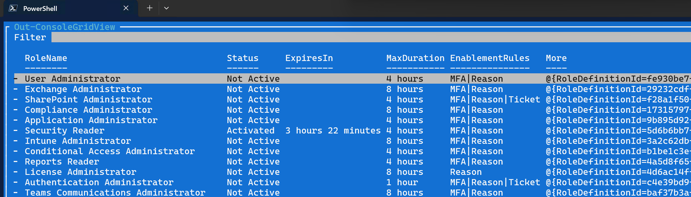
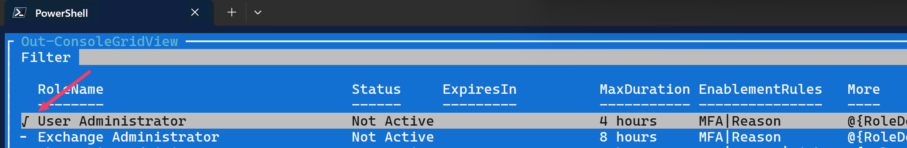
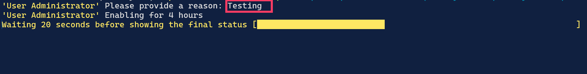
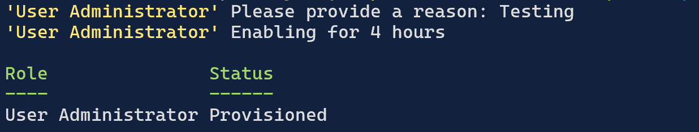

# Graph EasyPIM
Something to make Entra ID PIM easier for end-users. 

You can install the module [from PowerShell Gallery](https://www.powershellgallery.com/packages/Graph.EasyPIM/). 

```powershell
Install-Module -Name Graph.EasyPIM
```

Not using PowerShell Gallery? Download the source code from this 👇 repo, or get started with PowerShell Gallery following the instructions [here](https://learn.microsoft.com/en-gb/powershell/gallery/getting-started?view=powershellget-3.x).

Tested on Windows, macOS, and Linux with PowerShell 7.4. It currently has the following cmdlets:

- `Enable-PIMRole` - enable (activate) Entra ID PIM roles.
- `Enable-PIMGroup` - enable (activate) Entra ID PIM groups.
- `Disable-PIMRole` - disable (deactivate) Entra ID PIM roles.
- `Disable-PIMGroup` - disable (deactivate) Entra ID PIM groups.

## Neat features of this module
- You can select more than 1 role or group at a go. Both to activate or deactivate. 
- Faster than Entra ID portal in my opinion. There is an initial delay as it pulls all the info, but after that it's pretty fast. 
- By default, it activates the role or group for the maximum allowed duration. Supply `-Duration` to `Enable-PIMRole` or `Enable-PIMGroup` to request a shorter duration, for example `Enable-PIMRole -Duration (New-TimeSpan -Minutes 30)`. If the requested duration exceeds an item's allowed maximum, it activates for that maximum and shows a warning.
- When selecting roles or groups, if the role or group is already active (and it's been active for more than 5 mins) it will deactivate and activate the role or group. Very useful when you can see a role or group activation is going to expire soon!
- You can skip offering a reason, either via the `-SkipJustification` switch or pressing `ENTER` when asked for one. This will set the reason as `Activated using Graph.EasyPIM by $env:USER on $env:COMPUTERNAME`. 
- You can provide a justification before hand via the `-Justification` switch, or by entering one when prompted and adding an asterisk `*` at the end. This will set the same justification for all other roles or groups enabled in that round. 
- For ticketing policies, you are prompted for a ticket number and ticketing system unless `-TicketingSystem` is supplied. Leave the ticket number blank to use `12345`; leave the ticketing system blank (or enter `*`) to use `Fresh`. An asterisk after a ticketing-system name applies it to remaining selections.
- The [Norton Commander](https://en.wikipedia.org/wiki/Norton_Commander)-ish TUI is a nice trip down memory lane. 🙂

## Activating named roles and groups without the TUI

Pass `-RoleName` or `-GroupName` to activate known eligible assignments directly. When `-RoleName` is unsuffixed it selects only the tenant-wide role assignment. Use `RoleName:Scope` for a scoped role, where the scope exactly matches the value displayed by the TUI.

```powershell
$enablePimRoleParams = @{
    ClientId = '11111111-1111-1111-1111-111111111111'
    TenantId = '22222222-2222-2222-2222-222222222222'
    RoleName = @(
        'User Administrator'
        'Groups Administrator'
    )
}

Enable-PIMRole @enablePimRoleParams
```

For a scoped role, include the scope in the role name:

```powershell
$enablePimRoleParams = @{
    ClientId = '11111111-1111-1111-1111-111111111111'
    TenantId = '22222222-2222-2222-2222-222222222222'
    RoleName = 'User Administrator:Finance (Admin Unit)'
}

Enable-PIMRole @enablePimRoleParams
```

For groups, specify `:Member` or `:Owner` when the same group has eligible assignments of both types. An unsuffixed group name is accepted only when it has a single eligible assignment type.

```powershell
$enablePimGroupParams = @{
    ClientId = '11111111-1111-1111-1111-111111111111'
    TenantId = '22222222-2222-2222-2222-222222222222'
    GroupName = 'Contoso - Privileged Access:Member'
}

Enable-PIMGroup @enablePimGroupParams
```

PowerShell's `$PSDefaultParameterValues` preference hashtable can supply parameter values for each command. Add the following to your PowerShell profile to default the custom application details and activate named tenant-wide roles without the TUI:

```powershell
$PSDefaultParameterValues['Enable-PIMRole:ClientId'] = '11111111-1111-1111-1111-111111111111'
$PSDefaultParameterValues['Enable-PIMRole:TenantId'] = '22222222-2222-2222-2222-222222222222'
$PSDefaultParameterValues['Enable-PIMRole:RoleName'] = @(
    'User Administrator'
    'Groups Administrator'
)

Enable-PIMRole
```

An explicitly supplied parameter overrides its default. For example, this still displays the TUI because it replaces the configured role-name default with an empty array:

```powershell
Enable-PIMRole -RoleName @()
```

## Good to know
- The first time you run one of these cmdlets it will open up a browser window to authenticate. But if you are already connected to Graph, this might not happen and the cmdlets may not work. Do a `Disconnect-MgGraph` and then try the cmdlets again. 
- The lists of eligible PIM roles and groups are cached for 7 days within the current PowerShell session. Run `Enable-PIMRole -RefreshEligibleRoles` or `Enable-PIMGroup -RefreshEligibleGroups` to force a refresh.
- You might need to involve a Global Admin to do some consents on the `Microsoft Graph Command Line Tools` service principal. To do an admin consent on behalf of the organization, a Global Admin is required; but an Application Admin can do consent for themselves. 
    - This URL should help: `https://login.microsoftonline.com/{tenantId}/v2.0/adminconsent?client_id=14d82eec-204b-4c2f-b7e8-296a70dab67e&scope=RoleEligibilitySchedule.Read.Directory RoleEligibilitySchedule.ReadWrite.Directory RoleManagement.Read.Directory RoleManagement.Read.All RoleManagement.ReadWrite.Directory RoleAssignmentSchedule.ReadWrite.Directory RoleAssignmentSchedule.Remove.Directory PrivilegedEligibilitySchedule.Read.AzureADGroup PrivilegedEligibilitySchedule.ReadWrite.AzureADGroup PrivilegedAccess.Read.AzureADGroup PrivilegedAccess.ReadWrite.AzureADGroup RoleManagementPolicy.Read.AzureADGroup`
    - Of course, replace `{tenantId}` above.
- If the preference is to use a custom application, create one following the steps [here](https://learn.microsoft.com/en-us/powershell/microsoftgraph/authentication-commands?view=graph-powershell-1.0#use-delegated-access-with-a-custom-application-for-microsoft-graph-powershell) and add the permissions above to it. After it is admin consented to by a Global Admin, you can connect using `Enable-PIMRole -ClientId <YOUR_NEW_APP_ID> -TenantId <YOUR_TENANT_ID>` (same switches for all the other cmdlets)

## Pre-requisite modules
This modules depends upon the following. 

- `Microsoft.Graph.Authentication`
- `Microsoft.Graph.Identity.Governance`
- `Microsoft.Graph.Identity.SignIns`
- `Microsoft.PowerShell.ConsoleGuiTools`
- `Microsoft.Graph.Users`
- `Microsoft.Graph.Identity.DirectoryManagement`

```powershell
$moduleNames = @(
    'Microsoft.Graph.Authentication'
    'Microsoft.Graph.Identity.Governance'
    'Microsoft.Graph.Identity.SignIns'
    'Microsoft.Graph.Users'
    'Microsoft.Graph.Identity.DirectoryManagement'
    'Microsoft.PowerShell.ConsoleGuiTools'
)

Install-Module -Name $moduleNames
```

The Microsoft Graph PowerShell workload modules should be kept on matching versions because each module has a version-specific dependency on `Microsoft.Graph.Authentication`. If Graph.EasyPIM fails to import after an update, update all its Graph prerequisites together:

```powershell
$graphModuleNames = @(
    'Microsoft.Graph.Authentication'
    'Microsoft.Graph.Identity.Governance'
    'Microsoft.Graph.Identity.SignIns'
    'Microsoft.Graph.Users'
    'Microsoft.Graph.Identity.DirectoryManagement'
)

Update-Module -Name $graphModuleNames
```

If it weren't for these, this module wouldn't exist! Thank you 😍 to the creators of these, especially `Microsoft.PowerShell.ConsoleGuiTools` which is what I use to drive things. 🙏

## Screenshots
(These screenshots are from the first version of this module; the latest versions will have slight differences to what's shown below).

Running `Enable-PIMRole` lists all the available and active Entra ID PIM roles for the user.



Press `SPACE` to select <u>one or more</u> entries to activate them. (If a selected role is already active, it is deactivated and reactivated).



Press `ENTER`. This is what starts the activation process. The previous step only selects the ones we wish to activate.

Enter a reason or ticket number if the role requires it. 



Wait a bit for it to show the final status. 



That's it! 

Way faster than the Entra ID portal. And you can select more than 1 role at a go. 

## API reference
- [PIM for Entra roles](https://learn.microsoft.com/en-us/graph/api/resources/privilegedidentitymanagementv3-overview?view=graph-rest-1.0) 
- [PIM for Groups](https://learn.microsoft.com/en-us/graph/api/resources/privilegedidentitymanagement-for-groups-api-overview?view=graph-rest-1.0)

 [](https://entra.news/p/entra-id-news-65-this-week-in-microsoft?open=false#%C2%A7learn) [](https://entra.news/p/entra-news-66-this-week-in-microsoft?open=false#%C2%A7from-the-community)